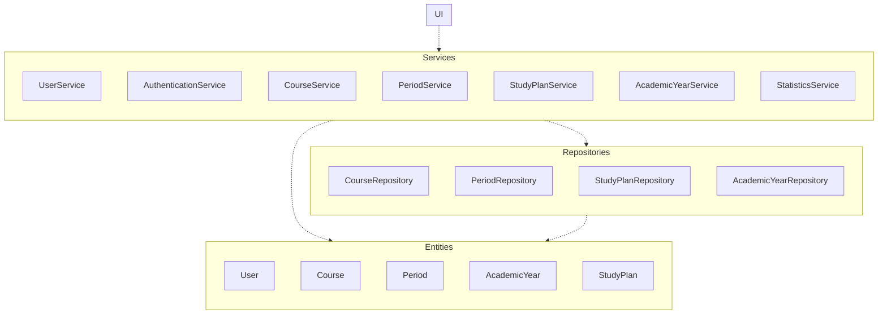
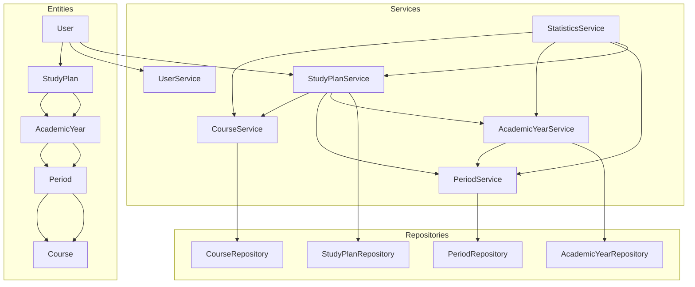
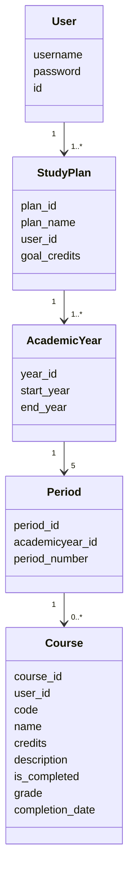
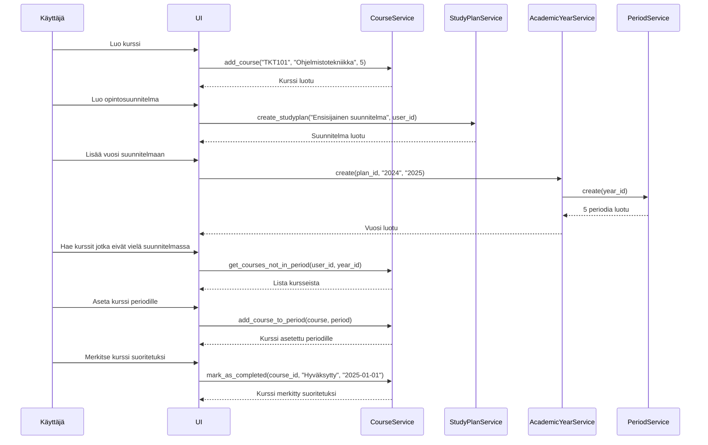

# Arkkitehtuurikuvaus

Ohjelman rakenne perustuu kerrosarkkitehtuuriin, joka jakautuu neljään pääkerrokseen: UI (käyttöliittymä), services, repositories ja entities.

UI-kerros vastaa ohjelman vuorovaikutuksesta käyttäjän kanssa, services-kerros sisältää sovelluslogiikan, repositories-kerros huolehtii tietokantaoperaatioista, kuten tietojen tallentamisesta, hakemisesta ja poistamisesta, ja entities-kerros määrittelee ohjelman käytössä olevat oliot.

## Käyttöliittymä

Käyttöliittymä sisältää useita eri näkymiä, jotka on toteutettu omana luokkanaan. Käyttöliittymä on eriytetty sovelluslogiikasta, ja kutsuu services-luokkien metodeita. Käyttöliittymän näkymien näyttämisestä vastaa UI-luokka.

## Sovelluksen arkkitehtuuri

Allaolevasta kuvasta näkee tärkemmin, miten eri luokat toimivat keskenään.

- CourseService vastaa kurssien hallinnasta, kuten kurssien lisäämisestä, poistamisesta, muokkaamisesta ja sijoittamisesta opintojaksoihin.
- PeriodService hallinnoi opintojaksoihin (periodit) liittyviä toimintoja, kuten niiden luomista ja hakemista.
- AcademicYearService käsittelee lukuvuosien logiikkaa ja tarjoaa tietoa eri lukuvuosista ja niiden jaksotuksesta.
- StudyPlanService vastaa opintosuunnitelmien luomisesta ja yhdistää siihen liittyviä kursseja, jaksoja ja lukuvuosia.
- StatisticsService hyödyntää muita service-luokkia tuottaakseen tilastotietoa opintosuunnitelman etenemisestä.

- Kukin service-luokka hyödyntää vastaavaa repository-luokkaa (paitsi StatisticsService, jolla ei ole omaa repositorya) tietokantayhteyksien hallintaan
- Entity-luokat kuvaavat sovelluksen keskeisiä tietorakenteita, eli Course, User, Period, AcademicYear ja StudyPlan.

### Sovelluslogiikka

Allaolevasta kaaviosta näkee käyttäjien, opintosuunnitelmien, vuosien, periodien ja kurssien välisen yhteyden.

- Käyttäjä voi luoda useita opintosuunnitelmia
- Yhteen opintosuunnitelmaan voi lisätä useita vuosia
- Yhdellä vuodella on viisi periodia (1, 2, 3, 4 ja kesä)
- Yhdessä periodssa voi olla rajaton määrä kursseja

### Sekvenssikaavio

Kaavio kuvaa, miten käyttäjä luo kurssin ja opintosuunnitelman, lisää kurssin suunnitelmaan ja merkitsee sen suoritetuksi.

Sovelluksen muissakin toiminnallisuuksissa noudatetaan samankaltaista rakennetta: käyttöliittymä reagoi käyttäjän toimintaan kutsumalla jonkin services-luokan metodia. Tämä services-luokka käsittelee tarvittavan sovelluslogiikan ja tekee mahdolliset tietokantakyselyt repositories-luokkien kautta. Kun tarvittavat muutokset on tehty, tieto palautuu services-luokan kautta käyttöliittymälle, joka päivittää näkymän vastaavasti.

## Tietojen tallennus

Sovellus käyttää SQLite tietokantaa. Tietokanta alustetaan initialize_database.py-tiedostossa. Aluksi poistetaan mahdolliset olemassaolevat taulut, ja luodaan sitten seuraavat taulut:

- users: sisältää käyttäjän tiedot (id, käyttäjätunnus, salasana).

- courses: Sisältää kursseja koskevat tiedot (id, käyttäjä-id, kurssikoodi, kurssin nimi, opintopisteet, kuvaus, suoritustiedot kuten arvosana ja suorituspäivämäärä).

- periods: sisältää periodit ja viittaa academicyears-tauluun, jolloin jokainen periodi on yhdistetty johonkin akateemiseen vuoteen suunnitelmassa

- course_periods: yhdistää kurssit tiettyihin periodeihin

- academicyears: sisältää akateemisten vuosien aloitus- ja lopetusvuodet, ja vuosien id:t

- studyplans: Sisältää opintosuunnitelmat (id, nimi, käyttäjän id ja tavoite opintopisteet).

- studyplan_academicyear: yhdistää opintosuunnitelmat ja akateemiset vuodet, jolloin jokainen akateeminen vuosi periodeineen ja kursseineen on sidottu johonkin opintosuunnitelmaan

Kun käyttäjä lisää, muuttaa tai hakee tietoja käyttöliittymässä, services-luokat (esimerkiksi CourseService, StudyPlanService) kutsuvat tietokannan käsittelyyn liittyviä metodeja, jotka sijaitsevat repository-luokissa. Nämä Repository-luokat käsittelevät SQL-kyselyt ja tietokannan muokkaukset.
