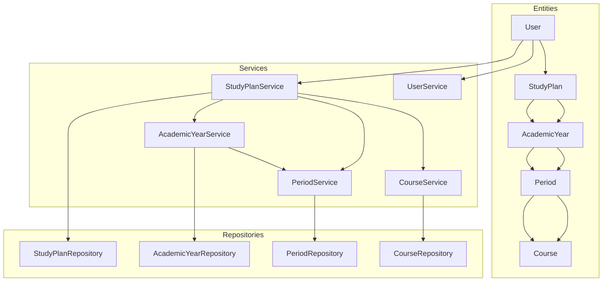
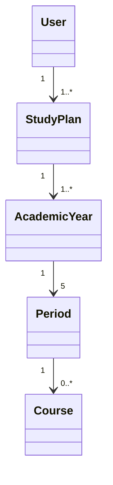
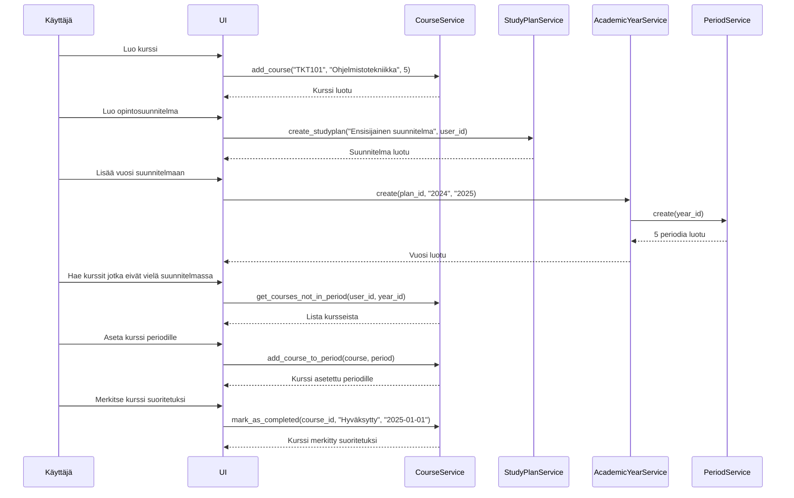

## Sovelluksen arkkitehtuuri

### Sovelluslogiikka

### Sekvenssikaavio

Kaavio kuvaa, miten käyttäjä luo kurssin ja opintosuunnitelman, lisää kurssin suunnitelmaan ja merkitsee sen suoritetuksi.

