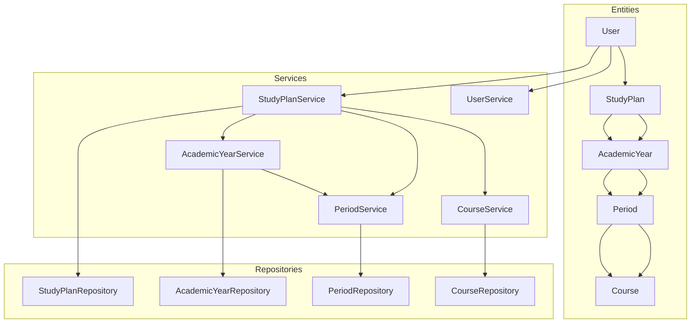
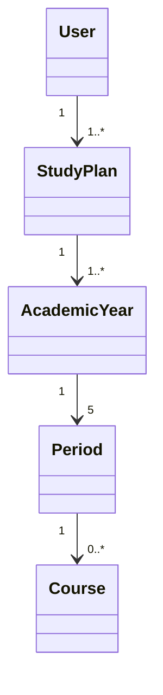

## Sovelluksen arkkitehtuuri

```mermaid
graph TD
    %% Entities Package
    subgraph Entities [Entities]
        User
        Course
        Period
        AcademicYear
        StudyPlan
    end

    %% Services Package
    subgraph Services [Services]
        UserService
        CourseService
        PeriodService
        StudyPlanService
        AcademicYearService
            end

    %% Repositories Package
    subgraph Repositories [Repositories]
        CourseRepository
        PeriodRepository
        StudyPlanRepository
        AcademicYearRepository
    end

    %% Relationships
    StudyPlanService --> StudyPlanRepository
    StudyPlanService --> AcademicYearService
    StudyPlanService --> PeriodService
    StudyPlanService --> CourseService
    CourseService --> CourseRepository
    PeriodService --> PeriodRepository
    AcademicYearService --> AcademicYearRepository
    AcademicYearService --> PeriodService

    StudyPlan --> AcademicYear
    AcademicYear --> Period
    Period --> Course
    User --> StudyPlanService
    User --> UserService


    %% Suhdeluvut tekstinä nuolen viereen
    StudyPlan --> AcademicYear
    AcademicYear --> Period
    Period --> Course
    User --> StudyPlan


```

### Sovelluslogiikka

```mermaid
classDiagram
    class User
    class StudyPlan
    class AcademicYear
    class Period
    class Course

    User "1" --> "1..*" StudyPlan
    StudyPlan "1" --> "1..*" AcademicYear
    AcademicYear "1" --> "5" Period
    Period "1" --> "0..*" Course
```
