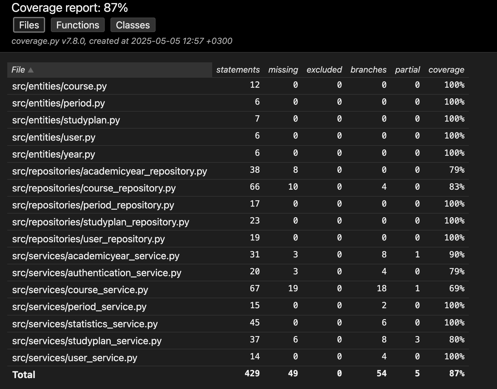

# Testausdokumentti

Sovelluksella on automatisoidut yksikkö- ja integraatiotestit, ja sovellusta on testattu myös manuaalisesti.

## Yksikkö- ja integraatiotestaus

Kaikille service- ja repository-luokille on toteutettu omat testiluokkansa. Testiluokat hyödyntävät SQLite-pohjaista testitietokantaa, joka alustetaan jokaisen testiluokan setUp-metodissa. Alustusprosessi tyhjentää tietokannan olemassa olevat taulut ja luo uudet, tyhjät taulut testien suoritusta varten.

Testit käyttävät tietokantayhteyttä, joka alustetaan kutsumalla `get_database_connection(test=True)`. Tämä varmistaa, että testit eivät koskaan käytä tuotantotietokantaa, vaan erillistä testitietokantaa.

Sovelluksen arkkitehtuurissa luokat ovat vahvasti sidoksissa toisiinsa, joten testit on rakennettu niin, että olioille injektoidaan niiden tarvitsemat riippuvuudet toisten luokkien instansseina, mikä mahdollistaa luokkien välisten yhteistoimintojen testaamisen tehokkaasti. Poikkeuksena on AuthenticationService, joka on testejä varten korvattu mock-toteutuksella.

### Testikattavuus

Testien haarautumakattavuus on 87%.

Testeistä on jätetty pois koko käyttöliittymä, sekä build.py, database_connection.py ja initialize_database.py -tiedostot. Raportin ulkopuolelle on jätetty käyttöliittymä, build.py, database_connection.py ja initialize_database.py.

## Järjestelmätestaus

Järjestelmätestaus on suoritettu manuaalisesti käyttöliittymän avulla.

Sovelluksen asentamista ja konfigurointia on testattu käyttöohjeen kuvaamalla tavalla macOS ja Linux ympäristöissä.

Sovelluksen toiminnallisuuksia on testattu käyttämällä eri näkymiä ja syöttämällä niihin erilaisia tietoja, mukaan lukien virheellisiä tai puutteellisia syötteitä. Näin varmistettiin, että käyttöliittymä reagoi oikein erilaisiin syöte- ja tilannevaihtoehtoihin, ja että virheenkäsittely toimii odotetusti.
