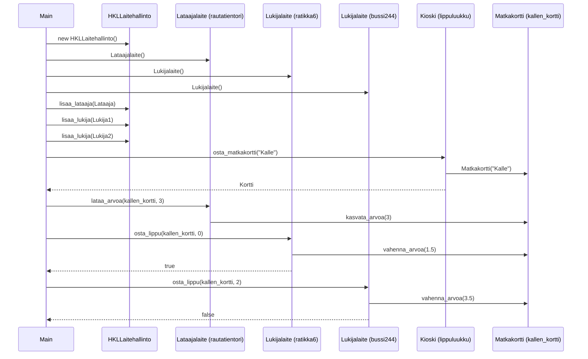

```mermaid
sequenceDiagram
    participant Main
    participant HKL as HKLLaitehallinto
    participant Lataaja as Lataajalaite (rautatientori)
    participant Lukija1 as Lukijalaite (ratikka6)
    participant Lukija2 as Lukijalaite (bussi244)
    participant Kioski1 as Kioski (lippuluukku)
    participant Kortti as Matkakortti (kallen_kortti)

    Main->>HKL: new HKLLaitehallinto()
    Main->>Lataaja: Lataajalaite()
    Main->>Lukija1: Lukijalaite()
    Main->>Lukija2: Lukijalaite()

    Main->>HKL: lisaa_lataaja(Lataaja)
    Main->>HKL: lisaa_lukija(Lukija1)
    Main->>HKL: lisaa_lukija(Lukija2)

    Main->>Kioski1: osta_matkakortti("Kalle")
    Kioski1->>Kortti: Matkakortti("Kalle")
    Kioski1-->>Main: Kortti

    Main->>Lataaja: lataa_arvoa(kallen_kortti, 3)
    Lataaja->>Kortti: kasvata_arvoa(3)

    Main->>Lukija1: osta_lippu(kallen_kortti, 0)
    Lukija1->>Kortti: vahenna_arvoa(1.5)
    Lukija1-->>Main: true

    Main->>Lukija2: osta_lippu(kallen_kortti, 2)
    Lukija2->>Kortti: vahenna_arvoa(3.5)
    Lukija2-->>Main: false
```
