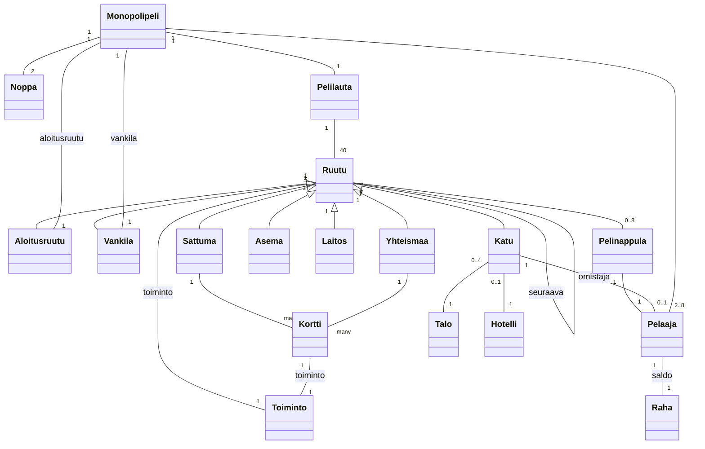

```mermaid
classDiagram
    Monopolipeli "1" -- "2" Noppa
    Monopolipeli "1" -- "1" Pelilauta
    Pelilauta "1" -- "40" Ruutu
    Ruutu "1" <|-- Aloitusruutu
    Ruutu "1" <|-- Vankila
    Ruutu "1" <|-- Sattuma
    Ruutu "1" <|-- Yhteismaa
    Ruutu "1" <|-- Asema
    Ruutu "1" <|-- Laitos
    Ruutu "1" <|-- Katu
    Ruutu "1" -- "1" Ruutu : seuraava
    Ruutu "1" -- "0..8" Pelinappula
    Ruutu "1" -- "1" Toiminto : toiminto
    Pelinappula "1" -- "1" Pelaaja
    Pelaaja "2..8" -- "1" Monopolipeli
    Monopolipeli "1" -- "1" Aloitusruutu : aloitusruutu
    Monopolipeli "1" -- "1" Vankila : vankila
    Sattuma "1" -- "many" Kortti
    Yhteismaa "1" -- "many" Kortti
    Kortti "1" -- "1" Toiminto : toiminto
    Katu "0..4" -- "1" Talo
    Katu "0..1" -- "1" Hotelli
    Katu "1" -- "0..1" Pelaaja : omistaja
    Pelaaja "1" -- "1" Raha : saldo

```
